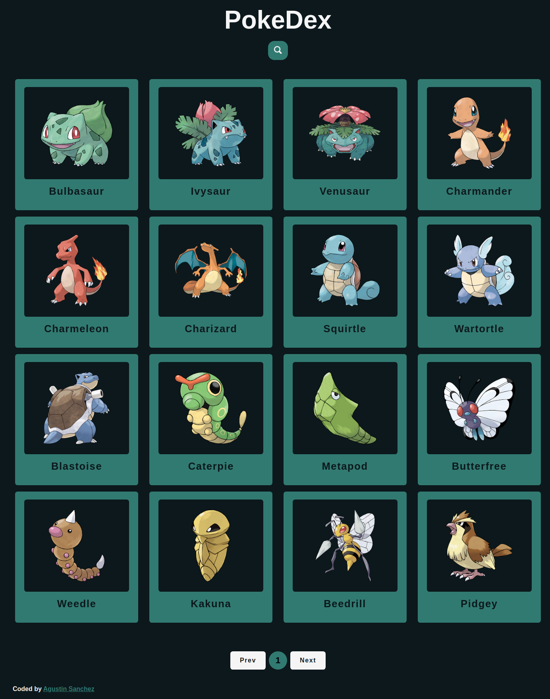
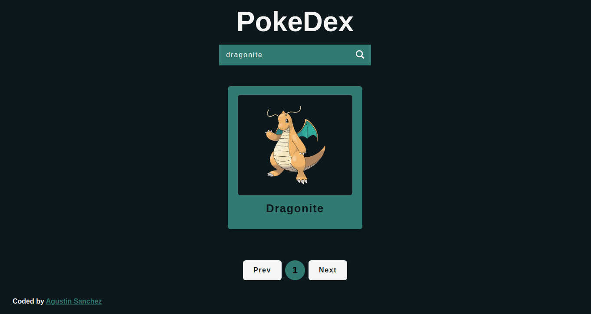

# PokeDex

This application communicates with an API that provides information about the different Pokémon species that appear in the Pokémon video game, anime and manga series.

Users should be able to:

- View the optimal layout depending on their device's screen size
- See a grid of different pokemon
- View pokemon stats

## Screenshots

- Desktop view

- Mobile view

## Links

- Deploy [Live site](https://pokedex-js-lilac.vercel.app/)
- API data from [exchangerate-host](https://pokeapi.co/)

## Built with

 
 
  
 

## Tests

### The UI was tested with 

## Author

- Linkedin - [Agustin Emanuel Sanchez](https://www.linkedin.com/in/agustin-emanuel-sanchez-4b2807240/)
- Frontend Mentor - [@agusscript](https://www.frontendmentor.io/profile/agusscript)
- CodePen - [Agustin Sanchez](https://codepen.io/agusscript)
- Twitter - [@agus_script](https://twitter.com/agus_script)
